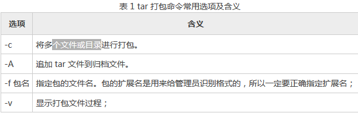
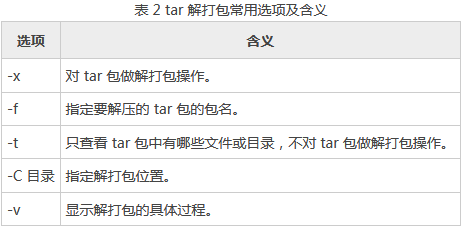

## 文件和目录管理

CD

    cd - # 回到上一次目录

mkdir

    mkdir -m 711 test2 # 使用-m设置文件夹权限

touch：修改文件时间或者创建文件（更新文件访问时间）；atime 文件访问时间，mtime 文件修改时间，ctime 文件状态修改时间。

    touch readme.txt
    touch -d "2019-08-08 12:12" readme.txt # 修改文件的atime和mtime
    ll --time=atime readme.txt # 查看文件修改时间

ln：软链接等同于win的快捷方式，硬链接会创建一个文件名指向其inode，它还有一些特点，删除源文件或者硬链接文件，剩下的文件都还能访问，修改其中一个文件其他都会改变，不能跨文件系统，不能连接目录

    ln readme.txt re # 不加参数默认是硬链接， 使用 ll -i readme.txt re -hard 查看的inode号是一样的

    ln -s readme.txt read # 软链接，可以链接目录

cp：复制

mv 移动

## 打包和压缩

tar

打包：

命令选项

    tar -cvf 1.tar study/ # 打包目录
    tar -cvf 2.zip 1.tar # 打包文件
    tar -cvf 4.zip readme.txt 1.tar study3 # 打包多个文件
    gzip 4.zip # 压缩gz文件

解压：

命令选项

    tar -xvf 1.zip # 解压到当前目录
    tar -xvf 1.zip -C mydir/ # 解压到指定目录
    tar -tvf 1.tar # 查看压缩包文件

    tar -zcvf tmp.tar.gz 1.tar # 直接打包gz文件
    tar -zxvf tmp.tar.gz # 直接解压gz文件
    tar -jcvf tmp.tar.bz2 1.tar # 直接打包bz2文件
    tar -jxvf tmp.tar.bz2 # 直接解压bz2文件

zip，unzip

    zip test.zip 1.tar 2.zip 4.zip.gz # 压缩多个文件
    zip -r test2.zip study/ # 压缩目录

    unzip test.zip # 解压
    unzip -d test2/ test.zip # 解压到指定目录

gzip，gunzip

    gzip 1.tar # 压缩源文件（源文件不存在）

## 文本处理

grep（global regular expressions print）：用正则处理文本

    grep read readme.txt

sed

     sed 's/happy/pleasure/2' 2.txt # 用pleasure替换一行中第二次出现的happy
     sed 's/happy/pleasure/g' 2.txt # 替换所有pleasure

     sed -n 's/pleasure/happy/p' 2.txt # 只展示替换的内容
     sed -n 's/happy/pleasure/g' 2.txt # 不展示文本

     sed 's/happy/pleasure/w 3.txt' 2.txt # 保存匹配的内容至3.txt