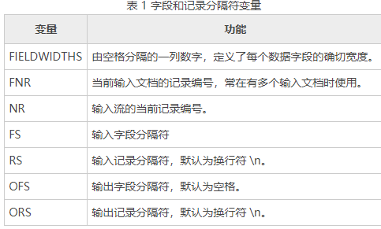

## 文件和目录管理

CD

    cd - # 回到上一次目录

mkdir

    mkdir -m 711 test2 # 使用-m设置文件夹权限

touch：修改文件时间或者创建文件（更新文件访问时间）；atime 文件访问时间，mtime 文件修改时间，ctime 文件状态修改时间。

    touch readme.txt
    touch -d "2019-08-08 12:12" readme.txt # 修改文件的atime和mtime
    ll --time=atime readme.txt # 查看文件修改时间

ln：软链接等同于win的快捷方式，硬链接会创建一个文件名指向其inode，它还有一些特点，删除源文件或者硬链接文件，剩下的文件都还能访问，修改其中一个文件其他都会改变，不能跨文件系统，不能连接目录

    ln readme.txt re # 不加参数默认是硬链接， 使用 ll -i readme.txt re -hard 查看的inode号是一样的

    ln -s readme.txt read # 软链接，可以链接目录

cp：复制

mv 移动

## 打包和压缩

tar

打包：

命令选项

    tar -cvf 1.tar study/ # 打包目录
    tar -cvf 2.zip 1.tar # 打包文件
    tar -cvf 4.zip readme.txt 1.tar study3 # 打包多个文件
    gzip 4.zip # 压缩gz文件

解压：

命令选项

    tar -xvf 1.zip # 解压到当前目录
    tar -xvf 1.zip -C mydir/ # 解压到指定目录
    tar -tvf 1.tar # 查看压缩包文件

    tar -zcvf tmp.tar.gz 1.tar # 直接打包gz文件
    tar -zxvf tmp.tar.gz # 直接解压gz文件
    tar -jcvf tmp.tar.bz2 1.tar # 直接打包bz2文件
    tar -jxvf tmp.tar.bz2 # 直接解压bz2文件

zip，unzip

    zip test.zip 1.tar 2.zip 4.zip.gz # 压缩多个文件
    zip -r test2.zip study/ # 压缩目录

    unzip test.zip # 解压
    unzip -d test2/ test.zip # 解压到指定目录

gzip，gunzip

    gzip 1.tar # 压缩源文件（源文件不存在）

## 文本处理

grep（global regular expressions print）：用正则处理文本

    grep read readme.txt

sed

     sed 's/happy/pleasure/2' 2.txt # 用pleasure替换一行中第二次出现的happy
     sed 's/happy/pleasure/g' 2.txt # 替换所有pleasure

     sed -n 's/pleasure/happy/p' 2.txt # 只展示替换的内容
     sed -n 's/happy/pleasure/g' 2.txt # 不展示文本

     sed 's/happy/pleasure/w 3.txt' 2.txt # 保存匹配的内容至3.txt

     sed '2,3d' 1.txt # 删除sed流中（屏幕显示）的指定行（原始文件没做任何改变）。

     sed '2i\study together.' 1.txt # sed流指定行前插入内容 --i
     sed '2a\study together.' 1.txt # sed流指定行后插入内容 --a

     sed '2i\study together.\
     love each other.' 1.txt # 数据流中插入多行。

     sed '2c\wo shi jiweidong.' 1.txt # 替换数据流中的指定行 --c

     sed 'y/123/789/' 1.txt # 数据流中把1，2，3分别替换成7，8，9 --y

     sed '1,2w test.txt' 1.txt # 将文本中指定行的内容写入文件中。--w

     sed '3r test.txt' 1.txt # 将test中的文本插入到数据流中的指定行（3） --r

     sed '2q' 1.txt # 第一次匹配后退出 --q

sed address

    sed '2,3s/love/like/g' 1.txt # 查找address 2,3 指定的区间内容

&
    sed '/line/{s//\<&\>/1}' 1.txt # &会将line替换成<line>

    sed '/first/{N ; s/\n/ /}' data2.txt # N命令将下一行合并到一行，并用s命令替换掉换行 --N

    sed 'N
    > s/System\nAdministrator/Desktop\nUser/
    > s/System Administrator/Desktop User/
    > ' data3.txt # 替换短语出现在多行的情况

`D` 多行删除；

## awk

基本格式：`awk 'regular{command}' file`

    awk '/^$/{print "Hello World"}' data3.txt # 查找空白行，匹配到输出Hello World
awk使用变量分配给文本中发现的数据字段：

* $0 代表整个文本行；
* $1 代表文本行中的第 1 个数据字段；
* $2 代表文本行中的第 2 个数据字段；
* $n 代表文本行中的第 n 个数据字段

    awk '{print $1}' data3.txt

命令字段可以使用多个命令

    awk '{$1="hefei";print $0}' data3.txt # 赋值个第一个数据字段 $1=xx,并打印整行

从文件中读取awk命令

    awk -F: -f awk.sh data3.txt
BEGIN会强制 awk 在读取数据前执行该关键字后指定的脚本命令：

    awk 'BEGIN{print "ilove you"} {print $1}' data3.txt
END 会强制 awk 在读取数据后执行该关键字后指定的脚本命令：
    awk 'END{print  "ilove you"} {print $1}' data3.txt

分隔符变量

    awk 'BEGIN{FS=",";OFS="-"}{print $1，$2,$3,$4}' data4.txt # 修改输入分隔符为","，设置输出分隔符为"-"

FIELDWIDTHS 变量允许用户不依赖分隔符来读取数字，通过字段中分配的数字来分割字段：例如：

    awk 'BEGIN{FIELDWIDTHS="5 5 5"}{print $1,$2,$3}' data4.txt # 按照 5 5 5个字符形式分割。